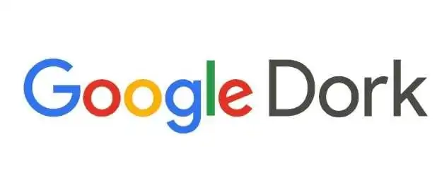

# 2025年Google Dorks完整列表及SQL注入数据库更新

你是不是经常听安全圈的人提到"Google黑客技术"？别紧张，这不是什么高深莫测的黑客手段。说白了，就是用谷歌搜索找到那些本该被好好保护，结果却被明晃晃晒在网上的敏感信息——登录页面、私密文件夹、服务器配置、甚至是用户凭证。本文带你了解**2025年最新的Google Dorks查询列表**，以及它们在SQL注入测试中的实战应用，让你知道哪些漏洞正在被盯上，又该如何防范。

---

## 什么是SQL注入?为什么它排在OWASP第一位?

SQL注入，简单说就是攻击者通过修改SQL查询语句，把恶意代码塞进你的数据库里。一旦成功，他们能干什么?翻看你的敏感数据、篡改数据库记录、提升权限、伪造身份，甚至直接让你的系统瘫痪。

这不是危言耸听。[OWASP](https://owasp.org/www-community/attacks/SQL_Injection)(开放Web应用安全项目)把SQL注入列为2025年最严重的Web安全威胁——**排名第一**。

常见的SQL注入威胁包括:
- 数据泄露
- 数据库记录篡改  
- 权限提升
- 身份伪造
- 拒绝服务攻击(DoS)

配合Google Dorks,攻击者可以快速定位存在SQL注入漏洞的目标站点。这也是为什么了解这些搜索技巧如此重要——不管你是安全研究员,还是开发者。



---

## Google Dorks怎么用?

用法超级简单:在谷歌搜索框里输入一个Dork查询语句,按回车,就能看到更精准的搜索结果。

### 几个实用的Dork查询示例

**1. 搜索教育网站的电话信息**
```
site:.edu "phone number"
```
这条命令会返回所有.edu域名下包含"phone number"字样的页面。

**2. 查找学校登录页面**
```
inurl:edu "login"
```
专门找教育机构网站上的登录入口。

**3. 搜索运行vBulletin论坛的政府网站**
```
"powered by vbulletin" site:.gov
```

**4. 查找军方网站的论坛系统**
```
"powered by vbulletin" site:.mil
```

**5. 商业网站的vBulletin论坛**
```
inurl:.com "powered by vbulletin"
```

**6. 查找可以注册的论坛**
```
inurl:.edu "register forum"
```

这些Dork看起来人畜无害,但组合起来能挖出不少意想不到的信息。

如果你需要大规模采集这些数据用于安全测试,👉 [ScraperAPI能帮你搞定大批量的网页抓取任务](https://www.scraperapi.com/?fp_ref=coupons)——它提供超过2000万个住宅IP,覆盖12个国家,还能处理JavaScript渲染和验证码问题,让你不用担心被服务器封禁。

---

## 2025年SQL注入专用Google Dorks数据库

下面是一份**更新到2025年的Google Dorks列表**,专门用于发现可能存在SQL注入漏洞的URL参数。这些查询能帮你快速定位那些未经充分过滤用户输入的页面。

```
view_items.php?id=
home.php?cat=
item_book.php?CAT=
www/index.php?page=
schule/termine.php?view=
goods_detail.php?data=
storemanager/contents/item.php?page_code=
customer/board.htm?mode=
help/com_view.html?code=
n_replyboard.php?typeboard=
eng_board/view.php?T****=
prev_results.php?prodID=
bbs/view.php?no=
gnu/?doc=
zb/view.php?uid=
global/product/product.php?gubun=
m_view.php?ps_db=
productlist.php?tid=
product-list.php?id=
onlinesales/product.php?product_id=
garden_equipment/Fruit-Cage/product.php?pr=
product.php?shopprodid=
product_info.php?products_id=
showsub.php?id=
productlist.php?fid=
products.php?cat=
product.php?sku=
store/product.php?productid=
products.php?cat=
productList.php?cat=
product_detail.php?product_id=
product.php?pid=
more_details.php?id=
county-facts/diary/vcsgen.php?id=
idlechat/message.php?id=
podcast/item.php?pid=
products.php?act=
details.php?prodId=
socsci/events/full_details.php?id=
ourblog.php?categoryid=
mall/more.php?ProdID=
archive/get.php?message_id=
review/review_form.php?item_id=
english/publicproducts.php?groupid=
news_and_notices.php?news_id=
rounds-detail.php?id=
gig.php?id=
board/view.php?no=
index.php?modus=
news_item.php?id=
rss.php?cat=
details.php?ProdID=
els_/product/product.php?id=
store/description.php?iddesc=
socsci/news_items/full_story.php?id=
naboard/memo.php?bd=
bookmark/mybook/bookmark.php?bookPageNo=
board/board.html?table=
kboard/kboard.php?board=
order.asp?lotid=
goboard/front/board_view.php?code=
bbs/bbsView.php?id=
boardView.php?bbs=
eng/rgboard/view.php?&bbs_id=
product/product.php?cate=
content.php?p=
page.php?module=
?pid=
bookpage.php?id=
content.php?id=
news.php?ID=
photogallery.php?id=
index.php?id=
product/product.php?product_no=
nyheder.htm?show=
book.php?ID=
print.php?id=
detail.php?id=
content.php?PID=
more_detail.php?id=
view_items.php?id=
view_author.php?id=
main.php?id=
english/fonction/print.php?id=
magazines/adult_magazine_single_page.php?magid=
product_details.php?prodid=
magazines/adult_magazine_full_year.php?magid=
products/card.php?prodID=
catalog/product.php?cat_id=
e_board/modifyform.html?code=
community/calendar-event-fr.php?id=
products.php?p=
```

*(完整列表包含数千条查询,以上为精选示例)*

---

## Google Dorks的高级搜索操作符

想玩转Google Dorks,你得掌握这些搜索操作符。它们就像是给谷歌下达的精确指令。

### 核心操作符

**cache:**  
查看谷歌缓存的网页版本
```
cache:www.google.com web
```

**link:**  
查找指向某个网页的所有链接
```
link:www.google.com
```

**related:**  
查找类似的网站
```
related:www.google.com
```

**info:**  
显示网站的基本信息
```
info:www.google.com
```

**define:**  
获取词语定义
```
define:google
```

**stocks:**  
查询股票信息(需输入股票代码)
```
stocks: intc yhoo
```

**site:**  
限定搜索特定域名
```
help site:www.google.com
```

**allintitle:**  
所有关键词必须出现在标题中
```
allintitle: google search
```

**intitle:**  
指定关键词出现在标题中
```
intitle:google search
```

**allinurl:**  
所有关键词必须出现在URL中
```
allinurl: google search
```

**inurl:**  
指定关键词出现在URL中
```
inurl:google search
```

---

## 为什么PHP和ASP更容易中招?

你可能注意到了,SQL注入在PHP和ASP应用中更常见。原因很简单:这些老牌技术的函数接口设计相对原始,开发者如果不注意,很容易写出有漏洞的代码。

相比之下,J2EE和ASP.NET的接口设计更安全,自带更多防护机制,被利用的可能性小得多。

但这不意味着新技术就高枕无忧——最终还是要看开发者有没有遵循安全编码规范。

---

## Google Dorks的双刃剑效应

Google Dorks是把双刃剑。

一方面,它能帮安全研究人员快速发现漏洞、提醒网站管理员修复问题。另一方面,黑客也在用同样的技术寻找攻击目标。

谷歌搜索引擎的初衷是索引互联网上的一切信息——图片、文本、视频、新闻。但它也会不小心索引到敏感信息:
- 电子邮件地址
- 登录凭证
- 敏感文件
- 网站漏洞
- 甚至财务信息

很多时候,**我们甚至不知道这些信息已经被公开了**。

举个例子:你在银行的账户信息理应不会出现在谷歌搜索结果里,但如果你在社交媒体上公开分享了自己的信息,那就另当别论了。问题的关键在于:**是不是我们自己把数据放在了公开位置,却没做好安全防护?**

如果你在做安全审计或渗透测试,需要批量验证网站漏洞,👉 [ScraperAPI的代理服务能让你的测试工作事半功倍](https://www.scraperapi.com/?fp_ref=coupons)。它能绕过反爬机制、处理复杂的JavaScript页面,让你专注于安全分析本身。

---

## 如何防范SQL注入和数据泄露?

既然知道了问题所在,那该怎么办?

### 防御SQL注入的最佳实践

1. **使用参数化查询**  
   永远不要直接拼接用户输入到SQL语句里。使用预处理语句(Prepared Statements)。

2. **输入验证和过滤**  
   对所有用户输入进行严格验证,只接受预期格式的数据。

3. **最小权限原则**  
   数据库账户只给必要的权限,别什么都用root账户。

4. **定期安全审计**  
   使用自动化工具扫描潜在漏洞,别等到被攻击了才发现。

5. **遵循OWASP指南**  
   - [SQL注入防御速查表](https://cheatsheetseries.owasp.org/cheatsheets/SQL_Injection_Prevention_Cheat_Sheet.html)
   - [查询参数化速查表](https://cheatsheetseries.owasp.org/cheatsheets/Query_Parameterization_Cheat_Sheet.html)

### 其他安全资源

- [SQL注入知识库](http://www.websec.ca/kb/sql_injection) - MySQL、MSSQL和Oracle SQL注入攻击参考指南
- [GreenSQL开源SQL注入过滤器](http://www.greensql.net/) - 用于保护数据库免受SQL注入攻击的开源防火墙
- Oracle开发者SQL注入攻击入门指南

---

## 总结

Google Dorks和SQL注入漏洞的关系就像是一面镜子——它既能让我们看清系统的弱点,也能被恶意利用。关键在于:**你是用它来加固防线,还是等着别人用它来攻击你?**

2025年,随着Web应用越来越复杂,安全威胁也在不断演变。但基本原则从未改变:
- 不要把敏感数据暴露在公开互联网上
- 遵循安全编码规范
- 定期审计和更新系统

记住,谷歌搜索本身没有错,错的是我们没有做好安全防护。遵循[OWASP](https://owasp.org/)的标准文档,为开发者和Web应用提供安全意识培训,才是长久之计。

如果你需要对大量URL进行安全测试或漏洞扫描,记得使用专业工具提高效率。像ScraperAPI这样的服务能帮你快速完成大规模数据采集和验证工作,不用担心IP被封或请求被限制——这样你就能把更多精力放在真正的安全分析上。
